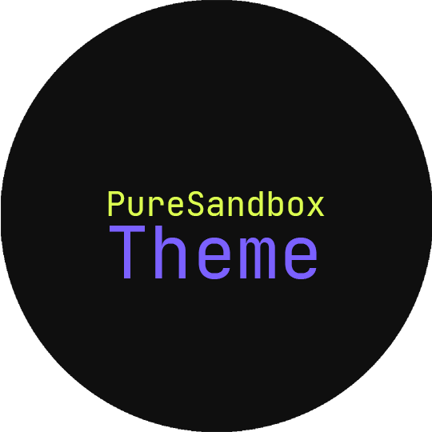
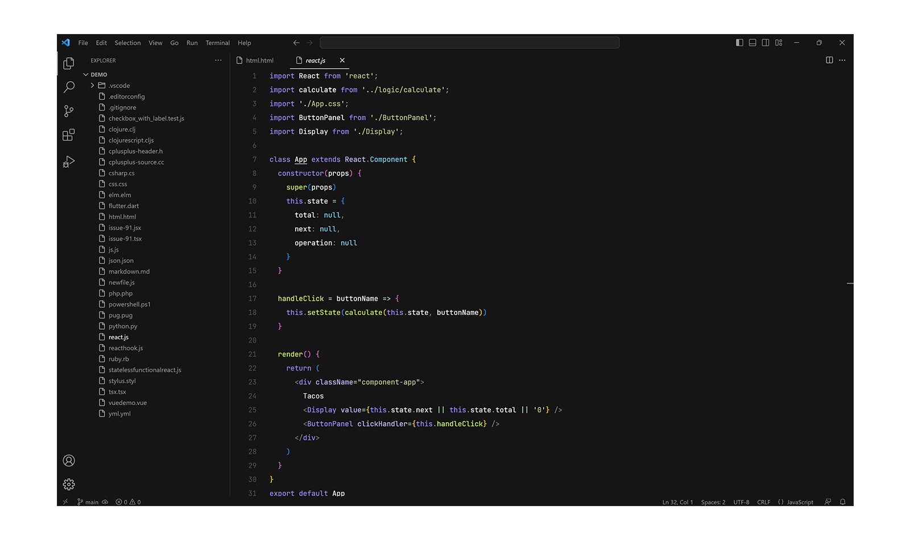

</img>

<h1 align="center"> PureSandbox theme</h1>

a visual studio code theme.

</img>

The preview showcases the theme with the following settings applied: No indent line, Enabled Command center, Jetbrains Mono font, No minimap, Disabled breadcrumbs, Icon theme: vs-minimal.

---

## DISCLAIMER

Please note that this theme is a work in progress and may not be suitable for all users. It is primarily made to meet my personal preferences. Certain elements, such as the minimap, haven't been taken into consideration as I do not utilize them in my workflow.

---

## Motivation

I developed this theme with two objectives in mind:

1. **Exploration**: To gain a deeper understanding of how themes are implemented in Visual Studio Code. It is important to emphasize that this theme is not intended for broad adoption or widespread use.
2. **Inspiration**: I sought to create a theme reminiscent of the official theme used by CodeSandbox. However, I was disappointed to find that the official theme did not match the preview (on windows). Consequently, I recreated the colors for vscode which is used in the editor on their website. All token colors in this theme have been sourced directly from the [CodeSandbox Visual Studio Code theme available on GitHub](https://github.com/codesandbox/vscode-theme).

---

**Your contribution is welcome! Feel free to explore and customize the theme according to your own preferences.**
